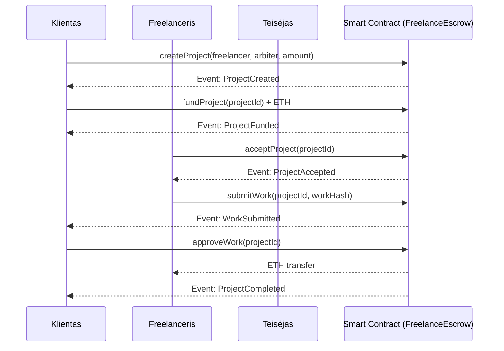

# SmartContract
# Freelance Escrow – Decentralizuota Freelance Paslaugų Atsiskaitymo Sistema

Šiame projekte įgyvendinama decentralizuota freelance paslaugų apmokėjimo sistema Ethereum tinkle. Sistema užtikrina saugų atsiskaitymą tarp kliento ir freelancerio naudojant escrow principą. Lėšos laikomos išmaniosios sutarties viduje tol, kol darbas patvirtinamas. Esant ginčui, sprendimą priima arbitras.

Projektas sukurtas naudojant:
- Solidity
- Remix IDE
- Truffle Framework
- Ganache lokaliam testavimui
- MetaMask
- Ethereum testnet (Sepolia)
- React ir ethers.js front-end aplikacijai

---

## 1. Verslo modelio aprašymas

Sukuriama freelance platforma, kurioje trys šalys gali saugiai atlikti atsiskaitymo procesą naudojant Ethereum išmaniąją sutartį. Klientas inicijuoja projektą ir perveda lėšas į escrow. Freelanceris priima darbą, atlieka jį ir pateikia rezultatą. Klientas gali patvirtinti darbą ir išmokėti lėšas freelancer’iui. Jeigu klientas nesutinka su atliktu darbu, jis gali inicijuoti ginčą, kurį išsprendžia arbitras.

Sistema panaikina pasitikėjimo poreikį tarp šalių, nes visą procesą koordinuoja išmanioji sutartis.

---

## 2. Pagrindiniai veikėjai

Klientas (Client) – užsako darbą, perveda projekto sumą į escrow, patvirtina ar atmeta atliktą darbą.

Freelanceris (Freelancer) – priima projektą, atlieka darbą ir pateikia rezultatą.

Teisėjas (Arbiter) – neutralus trečiasis asmuo, kuris sprendžia ginčus ir paskirsto lėšas.

Išmanioji sutartis (FreelanceEscrow) – laiko lėšas escrow režimu, prižiūri projekto būsenas ir vykdo lėšų pervedimus pagal nustatytas taisykles.

---

## 3. Išmaniosios sutarties logika

1. Klientas sukuria projektą nurodydamas freelancerio adresą, arbitro adresą ir projekto kainą.
2. Klientas perveda lėšas į escrow naudodamas `fundProject`.
3. Freelanceris priima projektą naudodamas `acceptProject`.
4. Freelanceris atlieka darbą ir pateikia rezultatą naudodamas `submitWork`.
5. Klientas gali patvirtinti darbą (`approveWork`) arba inicijuoti ginčą (`raiseDispute`).
6. Patvirtinus darbą, lėšos pervedamos freelancer’iui.
7. Ginčo atveju arbitras paskirsto lėšas naudodamas `resolveDispute`.

---

## 4. Projekto būsenos

Created – projektas sukurtas, lėšos nepervestos  
Funded – klientas pervedė lėšas į escrow  
InProgress – freelanceris priėmė projektą  
Submitted – freelanceris pateikė atliktą darbą  
Completed – darbas patvirtintas, lėšos pervestos freelancer’iui  
Cancelled – projektas atšauktas  
Disputed – inicijuotas ginčas  
Resolved – arbitras priėmė sprendimą

---

## 5. Tipiniai scenarijai

### Scenarijus 1: Projekto įvykdymas
1. Klientas sukuria projektą.
2. Klientas perveda lėšas į escrow.
3. Freelanceris priima projektą.
4. Freelanceris pateikia atliktą darbą.
5. Klientas patvirtina rezultatą.
6. Lėšos išmokamos freelancer’iui.

### Scenarijus 2: Projekto atšaukimas
Jei darbas nepateiktas, projektas gali būti atšauktas, o lėšos grąžinamos klientui.

### Scenarijus 3: Ginčas
1. Freelanceris pateikia darbą.
2. Klientas inicijuoja ginčą.
3. Teisėjas išnagrinėja ginčą.
4. Teisėjas paskirsto lėšas tarp kliento ir freelancerio.

---

## 6. Sekų diagramos (Sequence Diagrams)

### 6.1 Projekto įvykdymo seka

### 6.2 Ginčo scenarijaus seka

sequenceDiagram
    participant Client as Klientas
    participant Freelancer as Freelanceris
    participant Arbiter as Teisėjas
    participant Contract as Smart Contract

    Freelancer->>Contract: submitWork(projectId, workHash)
    Client->>Contract: raiseDispute(projectId)
    Contract-->>Client: Event: DisputeOpened

    Arbiter->>Contract: resolveDispute(projectId, clientShare, freelancerShare)
    Contract-->>Client: ETH refund
    Contract-->>Freelancer: ETH payout
    Contract-->>Arbiter: Event: DisputeResolved

## 7. Techninė architektūra

Išmanioji sutartis FreelanceEscrow.sol apima:
1.	Projekto būsenų mašiną (enum State)
2.	Projekto struktūrą (struct Project)
3.	Projektų registrą (mapping(uint256 => Project))

4. Modifikatorius:
⦁	onlyClient
⦁	onlyFreelancer
⦁	onlyArbiter
⦁	inState

5. Įvykius:
⦁	ProjectCreated
⦁	ProjectFunded
⦁	ProjectAccepted
⦁	WorkSubmitted
⦁	ProjectCompleted
⦁	DisputeOpened
⦁	DisputeResolved

6. Saugų ETH pervedimą naudojant call

8. Failų struktūra
FreelanceEscrow/
│
├── contracts/
│ └── FreelanceEscrow.sol
│
├── migrations/
│ └── 1_deploy_contracts.js
│
├── test/
│ └── FreelanceEscrow.test.js
│
├── client/
│ ├── src/
│ ├── package.json
│ └── ...
│
├── truffle-config.js
└── README.md

9. Diegimo ir testavimo instrukcijos

9.1 Ganache
⦁	Paleisti Ganache
⦁	Sukurti naują workspace
⦁	RPC adresas: http://127.0.0.1:7545

9.2 Truffle komandos
Kompiliavimas:
truffle compile

Deploy į lokalų tinklą:
truffle migrate --network development

Testai:
truffle test

9.3 Deploy į Sepolia
.env failas:
SEPOLIA_RPC_URL=<rpc_url>
PRIVATE_KEY=<private_key>

Migracija:
truffle migrate --network sepolia

Kontrakto peržiūra:
https://sepolia.etherscan.io

10. Front-End dApp funkcinis aprašymas

Front-end aplikacija suteikia galimybes:
⦁	prisijungti per MetaMask
⦁	sukurti projektą
⦁	pervesti projekto lėšas
⦁	freelancer’iui priimti projektą
⦁	pateikti atliktą darbą
⦁	patvirtinti darbą arba inicijuoti ginčą
⦁	matyti projekto būseną ir istoriją

Naudojamos technologijos:
⦁	React
⦁	Vite
⦁	ethers.js
⦁	MetaMask