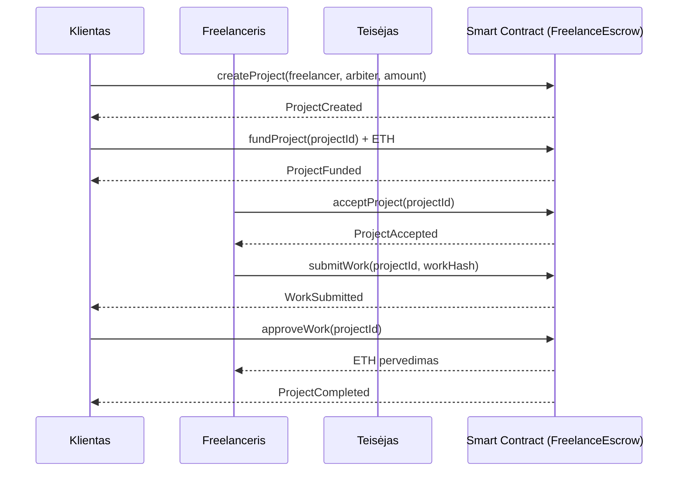
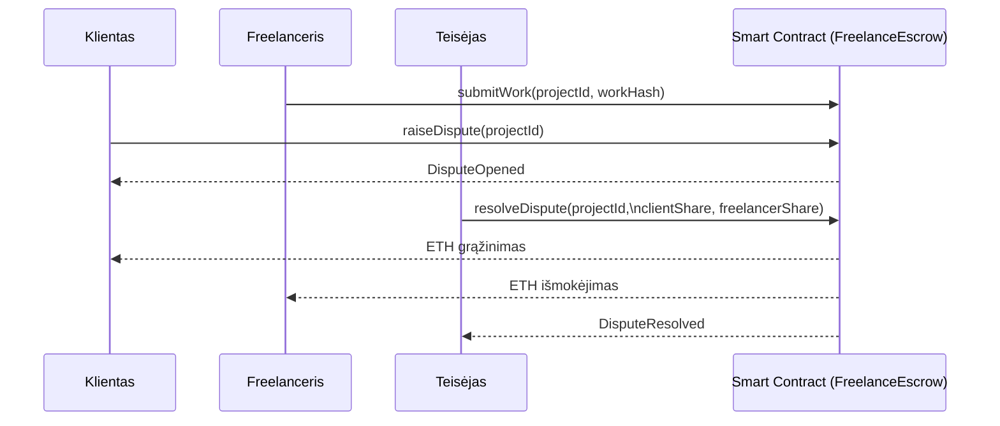

# SmartContract
# Freelance Escrow – Decentralizuota Freelance Paslaugų Atsiskaitymo Sistema

Šiame projekte įgyvendinta decentralizuota freelance paslaugų atsiskaitymo sistema, veikianti Ethereum blockchain tinkle. Sistema sukurta remiantis escrow principu ir užtikrina saugų bei skaidrų atsiskaitymą tarp kliento ir freelancer’io be tarpininkų.

Kliento pervestos lėšos yra laikomos išmaniojoje sutartyje tol, kol darbas yra patvirtinamas. Esant ginčui tarp šalių, sprendimą priima iš anksto paskirtas arbitras, o išmanioji sutartis automatiškai paskirsto lėšas pagal jo sprendimą.


## 1. Naudotos technologijos
Projektas sukurtas naudojant:
- Solidity – išmaniosios sutarties kūrimui
- Remix IDE – pirminiam sutarties testavimui
- Truffle Framework – projektui valdyti, diegti ir testuoti
- Ganache – lokaliam blockchain testavimui
- MetaMask – piniginės ir vartotojo autentifikacijai
- Ethereum testnet (Sepolia) – testiniam diegimui
- React ir ethers.js – front-end decentralizuotai aplikacijai (dApp)

## 2. Verslo modelio aprašymas

Sukuriama decentralizuota freelance paslaugų platforma, kurioje dalyvauja trys pagrindinės šalys: *klientas*, *freelancer’is* ir *arbitras*. <br /> 

Procesas vyksta taip:<br /> 
- klientas sukuria projektą ir perveda sutartą ETH sumą į išmaniąją sutartį (escrow),
- freelancer’is priima projektą, atlieka darbą ir pateikia rezultatą,
- klientas patvirtina darbą, o lėšos automatiškai pervedamos freelancer’iui.

Jeigu klientas nesutinka su atliktu darbu, jis gali inicijuoti ginčą. Tokiu atveju sprendimą priima *arbitras*, kuris nustato, kaip turi būti paskirstytos sutartyje laikomos lėšos.

Visa projekto eiga yra automatizuota ir valdoma išmaniosios sutarties, todėl sistema panaikina pasitikėjimo poreikį tarp šalių, užtikrina skaidrumą ir sumažina atsiskaitymo riziką.

## 3. Pagrindiniai veikėjai

Sistemoje dalyvauja keturi pagrindiniai veikėjai, kurie kartu užtikrina saugų ir skaidrų atsiskaitymo procesą: <br /> 

**Klientas (Client)**<br/> 
Inicijuoja projektą, perveda sutartą ETH sumą į escrow mechanizmą bei priima sprendimą patvirtinti arba atmesti pateiktą darbą.

**Freelancer’is (Freelancer)**<br/> 
Priima projektą, atlieka sutartą darbą ir pateikia jo rezultatą per išmaniąją sutartį.

**Teisėjas (Arbiter)**<br/> 
Neutralus trečiasis asmuo, kuris įtraukiamas tik ginčo atveju. Jis išnagrinėja situaciją ir nustato, kaip turi būti paskirstytos escrow laikomos lėšos.

**Išmanioji sutartis (FreelanceEscrow)**<br/> 
Veikia kaip automatinis tarpininkas: saugo lėšas escrow režimu, valdo projekto būsenas ir vykdo ETH pervedimus pagal iš anksto apibrėžtas taisykles.


## 4. Išmaniosios sutarties logika

Išmanioji sutartis FreelanceEscrow apibrėžia aiškią projekto vykdymo seką nuo projekto sukūrimo iki galutinio atsiskaitymo arba ginčo išsprendimo.

Projekto eiga:
1. Klientas sukuria projektą nurodydamas freelancerio adresą, arbitro adresą ir projekto kainą.
2. Klientas finansuoja projektą, pervesdamas ETH lėšas į escrow naudodamas `fundProject`.
3. Freelancer’is patvirtina dalyvavimą projekte naudodamas `acceptProject`.
4. Atlikęs darbą, freelancer’is pateikia rezultatą naudodamas `submitWork`.
5. Klientas peržiūri pateiktą darbą ir:
    - patvirtina darbą naudodamas `approveWork`.
    - inicijuoja ginčą naudodamas `raiseDispute`.
6. Patvirtinus darbą, išmanioji sutartis automatiškai perveda lėšas freelancer’iui.
7. Ginčo atveju arbitras priima sprendimą ir paskirsto escrow laikomas lėšas naudodamas `resolveDispute`.

---

## 5. Projekto būsenos

Projekto eiga skirstoma į atskirus etapus, kurie parodo, kuriame vykdymo taške šiuo metu yra projektas – nuo sukūrimo iki užbaigimo arba ginčo išsprendimo.

- *Created* – projektas sukurtas, tačiau lėšos dar nepervestos
- *Funded* – klientas pervedė sutartą sumą į escrow
- *InProgress* – freelancer’is priėmė projektą ir pradėjo darbą
- *Submitted* – freelancer’is pateikė atlikto darbo rezultatą
- *Completed* – darbas patvirtintas, lėšos pervestos freelancer’iui
- Cancelled – projektas nutrauktas
- *Disputed* – tarp kliento ir freelancer’io inicijuotas ginčas
- *Resolved* – ginčas išspręstas arbitro sprendimu, lėšos paskirstytos

## 6. Tipiniai scenarijai

### Scenarijus 1: Projekto įvykdymas
1. Klientas sukuria projektą.
2. Klientas perveda lėšas į escrow.
3. Freelanceris priima projektą.
4. Freelanceris pateikia atliktą darbą.
5. Klientas patvirtina rezultatą.
6. Lėšos išmokamos freelancer’iui.

### Scenarijus 2: Projekto atšaukimas
Jei darbas nepateiktas, projektas gali būti atšauktas, o lėšos grąžinamos klientui.

### Scenarijus 3: Ginčas
1. Freelanceris pateikia darbą.
2. Klientas inicijuoja ginčą.
3. Teisėjas išnagrinėja ginčą.
4. Teisėjas paskirsto lėšas tarp kliento ir freelancerio.


## 7. Sekų diagramos (Sequence Diagrams)

### 7.1 Projekto įvykdymo seka

Šiame skyriuje pateikiama tipinė decentralizuotos „freelance“ sutarties vykdymo eiga, kai klientas užsako darbą iš freelancerio, o procesą prižiūri arbitras. Visi veiksmai atliekami per išmaniąją sutartį (Smart Contract), kuri užtikrina skaidrumą, lėšų saugumą ir automatinį atsiskaitymą.

#### Vykdymo etapai:

1. Projekto sukūrimas
Klientas sukuria naują projektą išmaniojoje sutartyje, nurodydamas:<br /> 
- freelancerio adresą,
- arbitro adresą,
- sutartą atlygio sumą (ETH).

2. Projekto finansavimas<br /> 
Klientas perveda sutartą ETH sumą į išmaniąją sutartį. Lėšos yra „užšaldomos“ (escrow) iki projekto pabaigos.

3. Projekto patvirtinimas freelancerio<br /> 
Freelanceris patvirtina, kad sutinka su projekto sąlygomis ir pradeda darbą.

4. Darbo pateikimas<br /> 
Freelanceris pateikia atlikto darbo įrodymą (pvz., „hash“ reikšmę), kuri leidžia užfiksuoti, kad darbas buvo perduotas klientui.

5. Darbo patvirtinimas ir atsiskaitymas <br /> 
Klientui patvirtinus, kad darbas atliktas tinkamai, išmanioji sutartis:<br /> 
- automatiškai perveda ETH freelanceriųi,
- pažymi projektą kaip užbaigtą.

#### Sekos diagrama

### 7.2 Ginčo scenarijaus seka
Ši diagrama vaizduoja scenarijų, kai klientas nėra patenkintas pateiktu darbu ir inicijuoja ginčą. Šiuo atveju sprendimą priima teisėjas, kuris paskirsto užšaldytas lėšas tarp kliento ir freelancerio pagal priimtą sprendimą.

*Vykdymo eiga:*
- Freelanceris pateikia atliktą darbą į išmaniąją sutartį.
- Klientas, nesutikdamas su darbo kokybe ar sąlygomis, inicijuoja ginčą.
- Išmanioji sutartis užregistruoja ginčą sistemoje.
- Teisėjas išnagrinėja situaciją ir paskirsto lėšas.
- Išmanioji sutartis automatiškai perveda ETH pagal sprendimą.

#### Sekos diagrama:


## 8. Techninė architektūra

Išmanioji sutartis FreelanceEscrow.sol realizuoja visą projekto logiką ir susideda iš šių pagrindinių dalių:

1. Projekto būsenų valdymas:
* Būsenų mašina (enum State) <br /> 
Apibrėžia visas galimas projekto būsenas (pvz. sukurtas, finansuotas, priimtas, darbas pateiktas, ginčas, užbaigtas).
Tai leidžia tiksliai kontroliuoti, kokius veiksmus galima atlikti kiekviename projekto etape.
* Projekto struktūra (struct Project) <br /> 
Saugo visą su projektu susijusią informaciją: klientą, freelancerį, teisėją, projekto sumą, būseną ir kita.
* Projektų registras (mapping(uint256 => Project)) <br /> 
Leidžia vienoje išmaniojoje sutartyje valdyti kelis projektus, kiekvienam suteikiant unikalų identifikatorių (projectId).

2. Prieigos kontrolė (modifikatoriai)<br /> 
Siekiant užtikrinti saugumą ir teisingą procesų eigą, naudojami šie modifikatoriai:
- onlyClient – leidžia funkciją vykdyti tik projekto klientui
- onlyFreelancer – leidžia funkciją vykdyti tik projekto freelancer’iui
- onlyArbiter – leidžia ginčus spręsti tik paskirtam teisėjui
- inState – užtikrina, kad funkcija būtų vykdoma tik tinkamoje projekto būsenoje

3. Įvykius:<br /> 
Visi svarbūs veiksmai yra fiksuojami „blockchain“ tinkle per įvykius:
- ProjectCreated – projektas sukurtas
- ProjectFunded – projektas finansuotas
- ProjectAccepted – freelanceris priėmė projektą
- WorkSubmitted – pateiktas atliktas darbas
- ProjectCompleted – projektas sėkmingai užbaigtas
- DisputeOpened – inicijuotas ginčas
- DisputeResolved – ginčas išspręstas
- Šie įvykiai leidžia front-end aplikacijai sekti projekto eigą ir atvaizduoti visą istoriją vartotojui.

4. ETH pervedimai

ETH pervedimai atliekami naudojant call metodą, kuris yra saugus ir plačiai naudojamas sprendimas Solidity kontraktuose.
Jis leidžia patikimai pervesti lėšas tarp projekto dalyvių.

5. Projekto struktūra
```
FreelanceEscrow/
│
├── contracts/
│ └── FreelanceEscrow.sol
│
├── migrations/
│ └── 1_deploy_contracts.js
│
├── test/
│ └── FreelanceEscrow.test.js
│
├── client/
│ ├── src/
│ ├── package.json
│ └── ...
│
├── truffle-config.js
└── README.md
```
6. Diegimas ir testavimas

##### Ganache
-	Paleisti Ganache
-	Sukurti naują workspace
-	RPC adresas: `http://127.0.0.1:7545`

##### Truffle komandos
Kompiliavimas: ```truffle compile```

Deploy į lokalų tinklą: ```truffle migrate --network development```

Testai: ```truffle test```

##### Deploy į Sepolia
Sukurkite .env failas:
```
SEPOLIA_RPC_URL=<rpc_url>
PRIVATE_KEY=<private_key>
```
Deploy komanda:
```
truffle migrate --network sepolia
```
Įdiegtą kontraktą galima peržiūrėti: ```https://sepolia.etherscan.io```

7. Front-End dApp funkcinis aprašymas

Front-end aplikacija leidžia vartotojams patogiai sąveikauti su išmaniąja sutartimi per naršyklę.

*Pagrindinės galimybės:*

-	prisijungti per **MetaMask**
-	sukurti projektą
-	pervesti projekto lėšas (ETH)
-	freelancer’iui priimti projektą
-	pateikti atliktą darbą
-	patvirtinti darbą arba inicijuoti ginčą
-	matyti projekto būseną ir istoriją

*Naudojamos technologijos:*
-	React
-	Vite
-	ethers.js
-	MetaMask