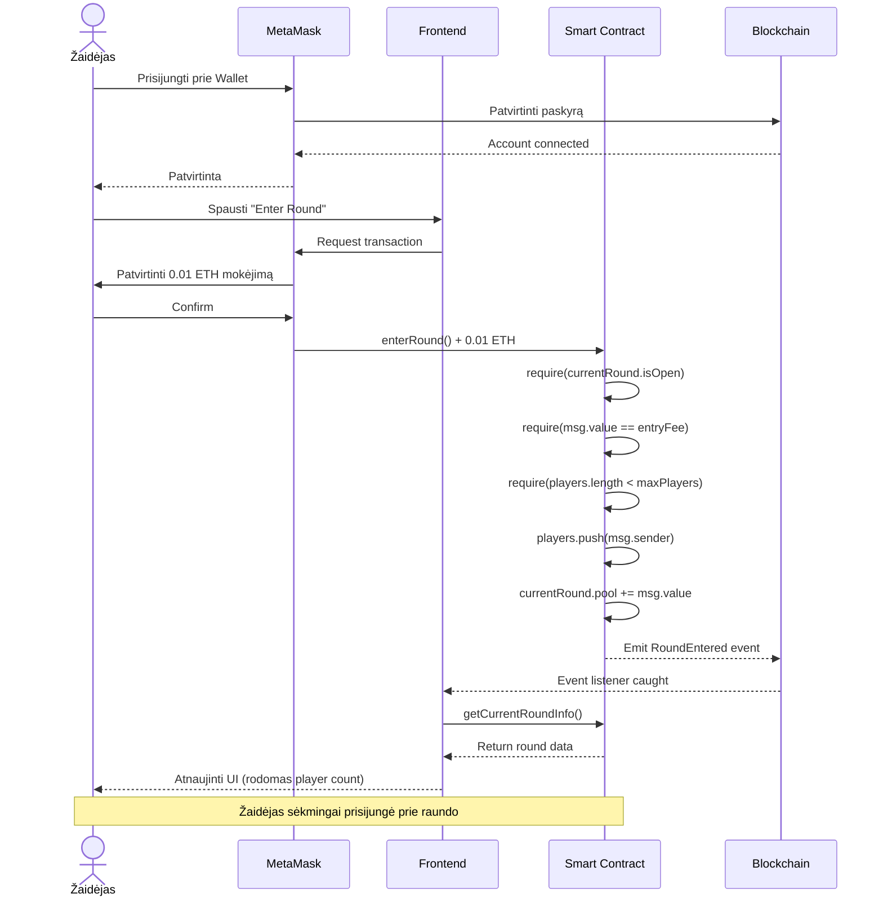
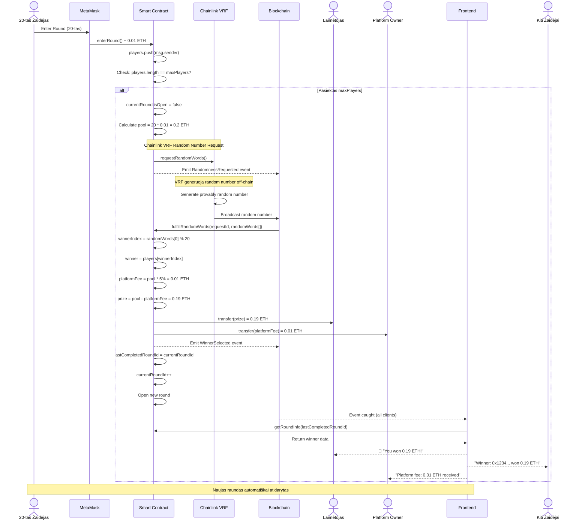
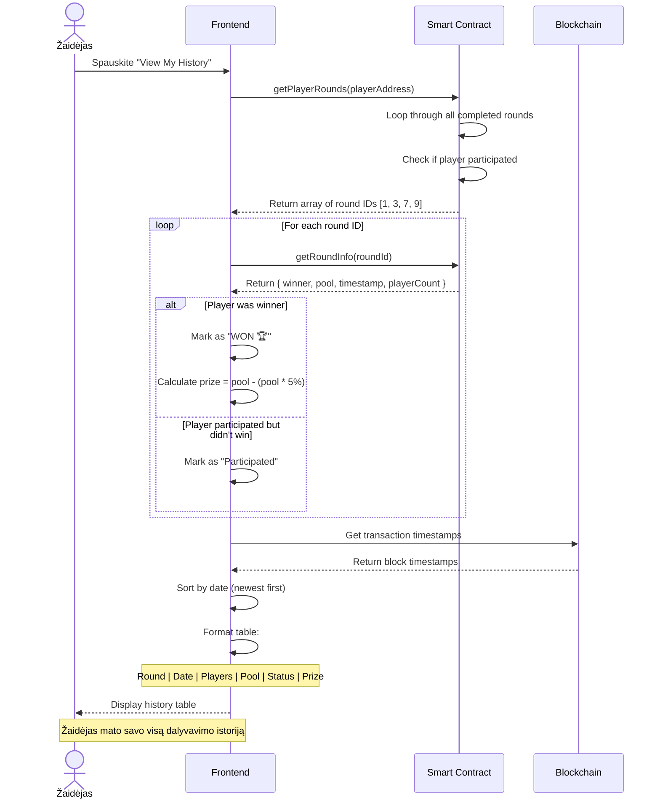
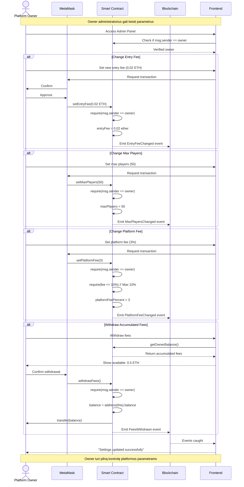
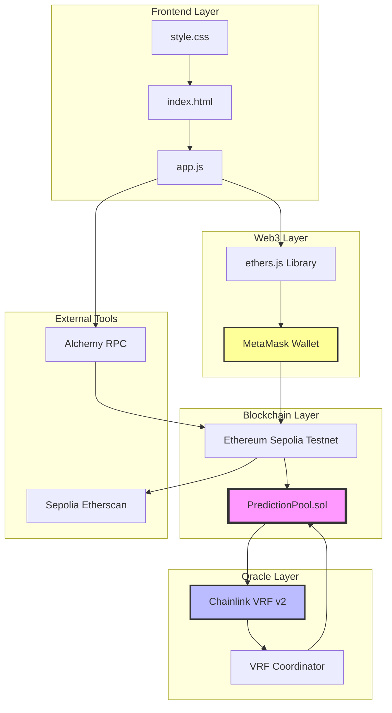

# Sequence Diagrams - Verslo Procesų Vizualizacija

## Kaip Peržiūrėti Diagramas

Šios diagramos naudoja Mermaid sintaksę. Galite jas peržiūrėti:

1. GitHub automatiškai renderina Mermaid diagramas
2. Arba eikite į https://mermaid.live/ ir paste kodą

---

## Diagrama 1: Žaidėjo Prisijungimas prie Raundo



**Žingsnių Aprašymas**:

1. Žaidėjas prisijungia prie MetaMask wallet
2. MetaMask patvirtina paskyrą blockchain tinkle
3. Žaidėjas spaudžia "Enter Round" mygtuką frontend'e
4. Frontend inicijuoja transakciją per MetaMask
5. MetaMask prašo patvirtinti 0.01 ETH mokėjimą
6. Smart contract patikrina:
   - Ar raundas atidarytas
   - Ar teisingas mokėjimo dydis
   - Ar neviršytas žaidėjų limitas
7. Contract prideda žaidėją į sąrašą ir padidina pool
8. Emituojamas RoundEntered event
9. Frontend pagauna event ir atnaujina UI

---

## Diagrama 2: Raundo Užbaigimas ir Laimėtojo Pasirinkimas



**Žingsnių Aprašymas**:

1. 20-tas žaidėjas prisijungia prie raundo (pasiekiamas maxPlayers)
2. Smart contract uždaro raundą
3. Contract išsiunčia request į Chainlink VRF
4. VRF generuoja tikrai atsitiktinį skaičių off-chain
5. VRF siunčia skaičių atgal į contract
6. Contract apskaičiuoja laimėtoją: `winnerIndex = randomNumber % 20`
7. Contract apskaičiuoja prizą ir platformos mokestį:
   - Visas pool: 0.2 ETH
   - Platform fee (5%): 0.01 ETH
   - Prize: 0.19 ETH
8. Contract automatiškai perveda ETH:
   - Laimėtojui → 0.19 ETH
   - Platform owner → 0.01 ETH
9. Emituojamas WinnerSelected event
10. Contract uždaro senąjį raundą ir atidaro naują
11. Frontend visuose klientuose pagauna event ir rodo rezultatus

---

## Diagrama 3: Istorijos Peržiūra



**Žingsnių Aprašymas**:

1. Žaidėjas spaudžia "View My History" mygtuką
2. Frontend kviečia `getPlayerRounds()` su žaidėjo address
3. Smart contract grąžina visus raundus, kuriuose žaidėjas dalyvavo
4. Frontend kiekvienam raundui:
   - Gauna raundo informaciją (laimėtojas, pool, žaidėjų skaičius)
   - Patikrina, ar žaidėjas laimėjo
   - Apskaičiuoja prizą, jei laimėjo
5. Frontend gauna timestamp'us iš blockchain
6. Frontend formuoja lentelę su:
   - Round number
   - Data
   - Žaidėjų skaičius
   - Pool dydis
   - Statusas (Won/Participated)
   - Prizas (jei laimėjo)
7. Rodo gražų history view žaidėjui

---

## Diagrama 4: Platform Owner Funkcijos



**Owner Funkcijos**:

1. **Change Entry Fee** - Pakeisti įnašo dydį (pvz., iš 0.01 → 0.02 ETH)
2. **Change Max Players** - Pakeisti maksimalų žaidėjų skaičių per raundą
3. **Change Platform Fee** - Pakeisti platformos mokestį (max 10%)
4. **Withdraw Fees** - Išsiimti sukauptus platformos mokesčius
5. **View Statistics** - Peržiūrėti platformos statistiką

---

## Sistemos Architektūros Diagrama



---

## Duomenų Srautų Diagrama

```mermaid
flowchart TD
    START([Žaidėjas atidaro aplikaciją]) --> CONNECT{MetaMask<br/>įdiegtas?}
    CONNECT -->|Ne| INSTALL[Rodyti instrukciją<br/>įdiegti MetaMask]
    CONNECT -->|Taip| AUTH[Prašyti prisijungti<br/>su MetaMask]

    AUTH --> NETWORK{Sepolia<br/>network?}
    NETWORK -->|Ne| SWITCH[Prašyti perjungti<br/>į Sepolia]
    NETWORK -->|Taip| LOAD[Užkrauti contract<br/>informaciją]

    LOAD --> DISPLAY[Rodyti current round:<br/>- Žaidėjų skaičius<br/>- Pool dydis<br/>- Entry fee]

    DISPLAY --> ACTION{Žaidėjo<br/>veiksmas}

    ACTION -->|Enter Round| CHECK1{Ar raundas<br/>atidarytas?}
    CHECK1 -->|Ne| ERROR1[Rodyti: Round closed]
    CHECK1 -->|Taip| CHECK2{Ar turi<br/>pakankamai ETH?}
    CHECK2 -->|Ne| ERROR2[Rodyti: Insufficient funds]
    CHECK2 -->|Taip| TX1[Siųsti enterRound()<br/>transakciją]

    TX1 --> WAIT1[Laukti patvirtinimo<br/>~15 sek]
    WAIT1 --> SUCCESS1{Transakcija<br/>sėkminga?}
    SUCCESS1 -->|Ne| ERROR3[Rodyti error message]
    SUCCESS1 -->|Taip| UPDATE1[Atnaujinti UI:<br/>Player count ++]

    UPDATE1 --> FULL{20 žaidėjų<br/>pasiekta?}
    FULL -->|Ne| DISPLAY
    FULL -->|Taip| VRF_REQ[Smart Contract<br/>Request VRF]

    VRF_REQ --> VRF_WAIT[Laukti random number<br/>~30-60 sek]
    VRF_WAIT --> VRF_FULFILL[VRF grąžina<br/>random number]
    VRF_FULFILL --> WINNER[Contract apskaičiuoja<br/>laimėtoją]

    WINNER --> TRANSFER[Contract perveda:<br/>- 0.19 ETH laimėtojui<br/>- 0.01 ETH platform]
    TRANSFER --> EVENT[Emit WinnerSelected<br/>event]

    EVENT --> NOTIFY{Ar user<br/>laimėjo?}
    NOTIFY -->|Taip| WIN[🎉 Rodyti:<br/>You won X ETH!]
    NOTIFY -->|Ne| LOSE[Rodyti laimėtoją]

    WIN --> NEWROUND[Naujas raundas<br/>automatiškai atidarytas]
    LOSE --> NEWROUND
    NEWROUND --> DISPLAY

    ACTION -->|View History| HISTORY[Užkrauti žaidėjo<br/>round history]
    HISTORY --> TABLE[Rodyti lentelę su:<br/>- Past rounds<br/>- Win/Loss status<br/>- Prizes]
    TABLE --> DISPLAY

    ACTION -->|Refresh| DISPLAY

    ERROR1 --> DISPLAY
    ERROR2 --> DISPLAY
    ERROR3 --> DISPLAY

    style START fill:#90EE90
    style WIN fill:#FFD700
    style ERROR1 fill:#FF6B6B
    style ERROR2 fill:#FF6B6B
    style ERROR3 fill:#FF6B6B
    style VRF_REQ fill:#87CEEB
    style TRANSFER fill:#98FB98
```

---

## Saugumo Tikrinimų Diagrama

```mermaid
flowchart TD
    ENTER[enterRound() iškviesta] --> C1{isOpen<br/>== true?}
    C1 -->|Ne| E1[❌ Revert:<br/>Round is closed]
    C1 -->|Taip| C2{msg.value<br/>== entryFee?}

    C2 -->|Ne| E2[❌ Revert:<br/>Incorrect entry fee]
    C2 -->|Taip| C3{players.length<br/>< maxPlayers?}

    C3 -->|Ne| E3[❌ Revert:<br/>Round is full]
    C3 -->|Taip| C4{Žaidėjas jau<br/>raunde?}

    C4 -->|Taip| E4[❌ Revert:<br/>Already entered]
    C4 -->|Ne| SUCCESS[✅ Priimti žaidėją]

    SUCCESS --> ADD[Pridėti į players[]]
    ADD --> POOL[Padidinti pool]
    POOL --> EVENT[Emit RoundEntered]

    EVENT --> FULL{players.length<br/>== maxPlayers?}
    FULL -->|Ne| END1[Laukti daugiau žaidėjų]
    FULL -->|Taip| CLOSE[Uždaryti raundą]

    CLOSE --> VRF[Request random number]
    VRF --> END2[Laukti VRF callback]

    style SUCCESS fill:#90EE90
    style E1 fill:#FF6B6B
    style E2 fill:#FF6B6B
    style E3 fill:#FF6B6B
    style E4 fill:#FF6B6B
    style VRF fill:#87CEEB
```

---

## Naudokite šias diagramas savo užduotyje!

1. **GitHub**: Diagramos automatiškai renderinamos
2. **Prezentacija**: Screenshot'as iš GitHub arba mermaid.live
3. **Dokumentacija**: Įtraukite į README.md

**Pastaba**: Galite redaguoti diagramas pagal poreikį:

- Pridėti daugiau detalių
- Pakeisti spalvas
- Pridėti papildomus scenarijus
